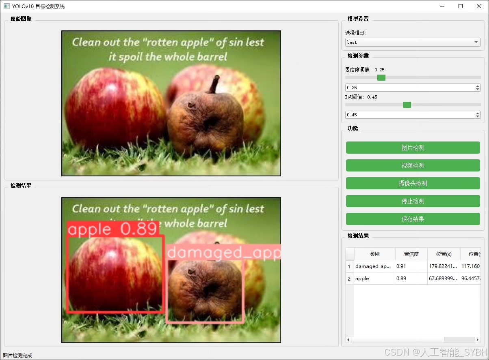
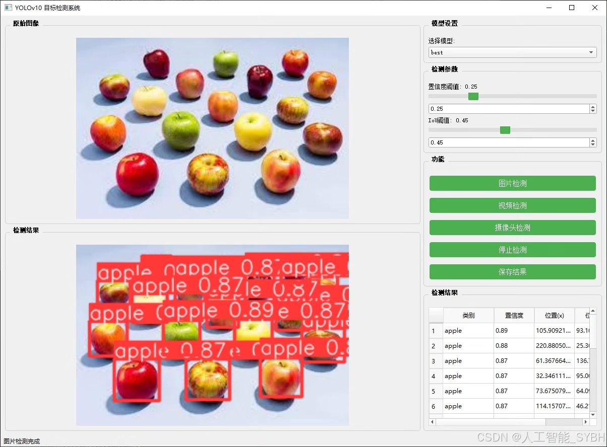
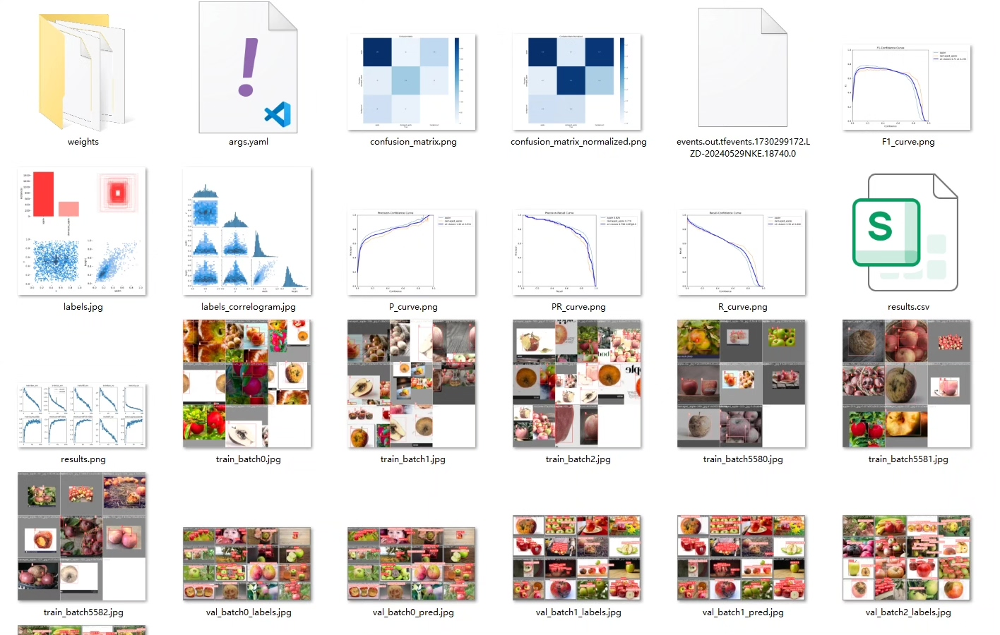
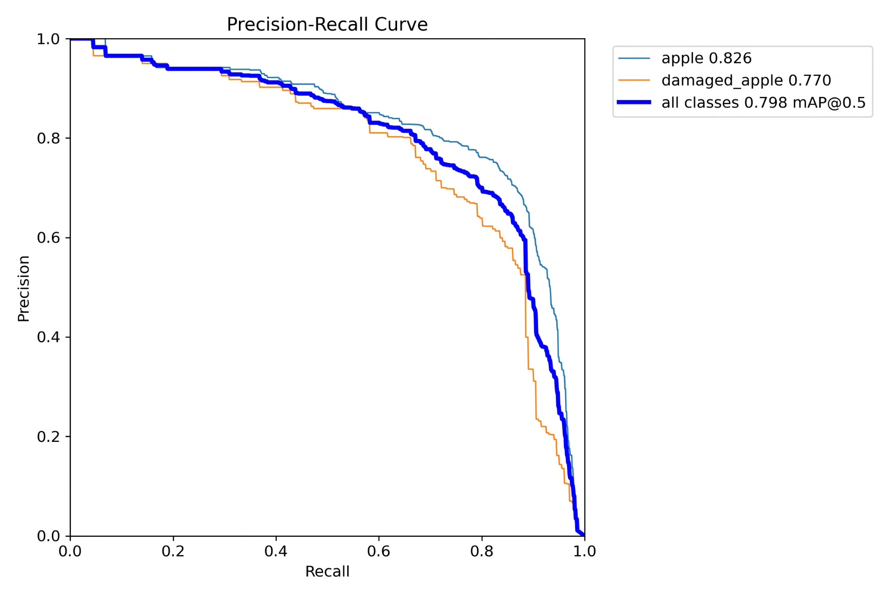
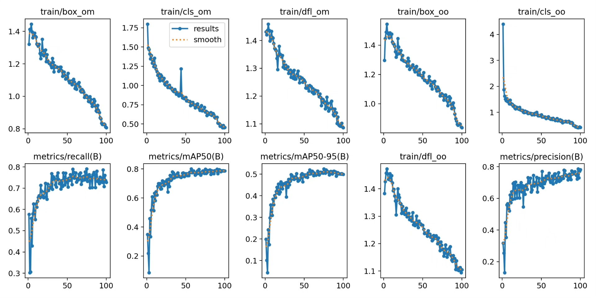
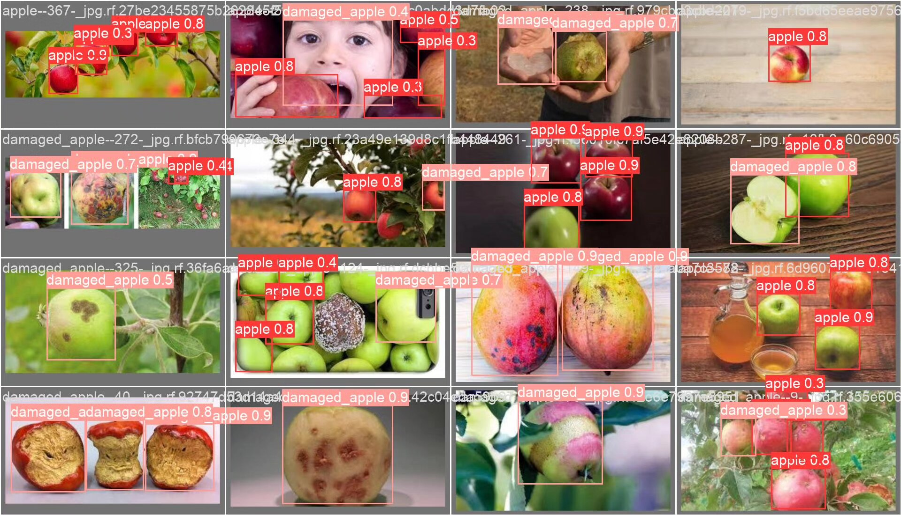
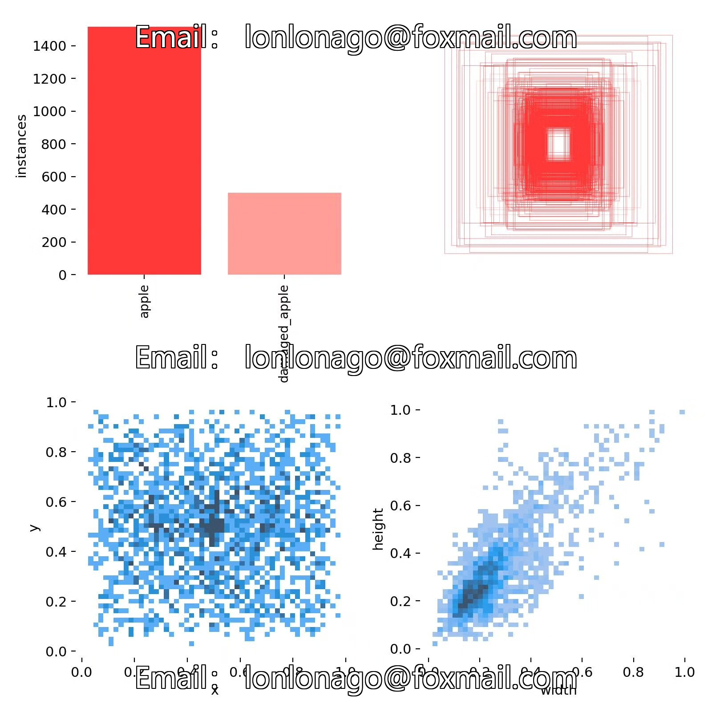
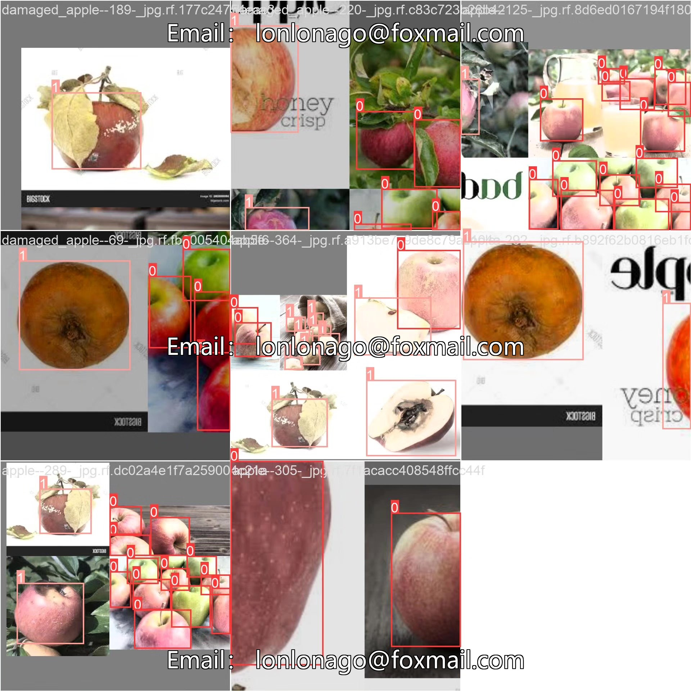

# Apple Freshness Detection System Based on YOLOv10 Deep Learning

## Body

YOLOv10 Apple Freshness Detection System (YOLOv10+YOLO dataset + UI interface + Python project source code + model)

The YOLOv10 Apple Detection System is an intelligent system based on the YOLOv10 (You Only Look Once version 10) object detection algorithm, specifically designed for detecting and classifying the state of apples. This system can automatically identify apples and categorize them into two types: apple (normal apple) and damaged_apple (damaged apple). Through this system, users can quickly detect the quality status of apples, suitable for orchard picking, fruit sorting, quality inspection, and other scenarios, helping to improve production efficiency and reduce labor costs.

Our company's products have obtained the official commercial license certification from YOLO.

We provide after-sales service.

After payment, we will provide WeChat IDs, ready to answer questions anytime.

Environmental configuration: We will provide a tutorial on environmental configuration, and WeChat will provide answers in a timely manner.

Remote installation service: If you need remote configuration, an additional fee of 69 is required,
failure in configuration will result in all fees refunded (specially for old computers only refund installation fees)

Retraining dataset: After configuring the environment, you can train on your own computer.
If you need us to retrain, just pay 69 plus computing power fees (2.5 yuan/hour)

Full package after-sales service

## Images

## Payment

Here is a pay link on Stripe ( https://buy.stripe.com/3cs8yP7sY87d0vu9AB ). Please contact me lonlonago@foxmail.com after funding $89, and I will send you a complete data files , thank you!

